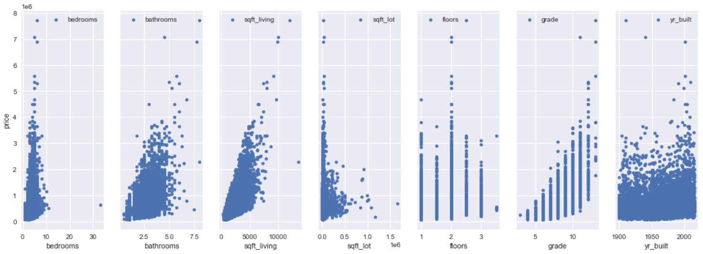
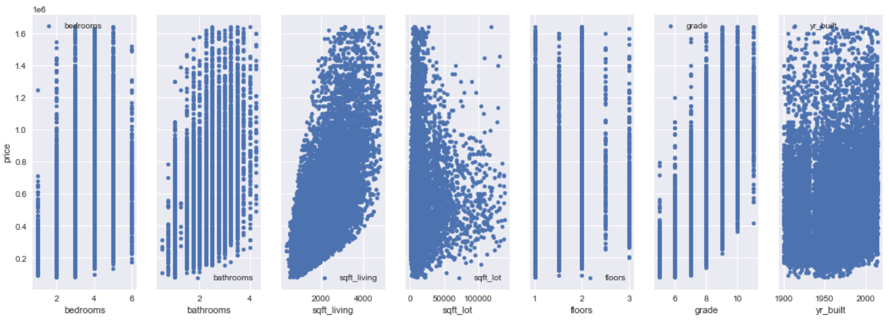
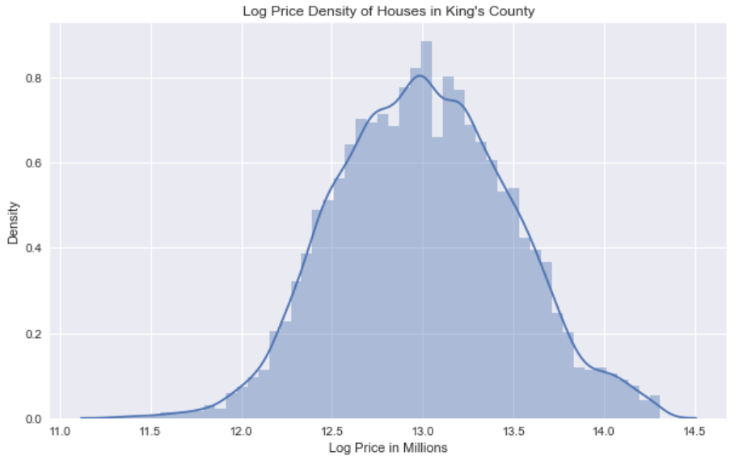

# King County Property Analysis
**Author:** Scott Graham

## Overview

The goal of this analysis is to review data from King County of property sale prices in 2014 and 2015 and provide insight to prospective buyers and sellers what property features will provide the best sale price.

## Business Problem and Hypothesis

**Ho (Null Hypothesis) -** There is no key indicators that any property features will increase sales price

**Ha (Alternative Hypothesis) -** There are indicators that certain features of a property will provide a higher chance of increased sales price

## Data Understanding

This project uses the King County House Sales dataset, which can be found in  `kc_house_data.csv` in the data folder in this repo. The description of the column names can be found in `column_names.md` in the same folder.
Reviewing the initial data and then removing from my best understanding what is irrelvant data for the goal of the analysis.

Initial data kept and reviewed were:
* id
* price
* bedrooms
* bathrooms
* sqft_living
* sqft_lot
* floors
* waterfront
* condition
* grade
* yr_built

Inital checks using Histogram, KDE and scatter plots to review basline data to see if it is normalised, what sort of skewness and if taking the logarithmic functions can be a usable solution to make the data more effective to work with.

## Data Cleaning

Removal of outliers initally as observations from the above scatter plot (eg. 33 bedrooms with a low sale price) and then performed a proper outlier removal using z-score.

Performing a log function on the base model price distribution yielded:

Performing a correlation matrix to further analyse the correlation between the chosen variables allowed us to further eliminate those with very low correlation to the price objective.

Which lead to the removal of:
* sqft_lot
* condition
* yr_built

## Regression Analysis

Return to log function of price:

Perform a Train-Test-Split at 70/30 split to provide a Mean Square Error for both the training model and the test model.

The MSE between the training and test model was quite close:
Train Mean Squarred Error: 0.4786065657498161
Test Mean Squarred Error: 0.4852373857492091

So we can draw our conclusions from this.

## Conclusions

We can reject the null hypothesis that there's no relationship between house prices and other factors such as the size of living area, bedrooms, bathrooms, etc. These factors do in fact have an effect on the price of a property. It appears that bigger is better, with more living area, more bedrooms and bathrooms typically reflected in a higher sale price of the properties.